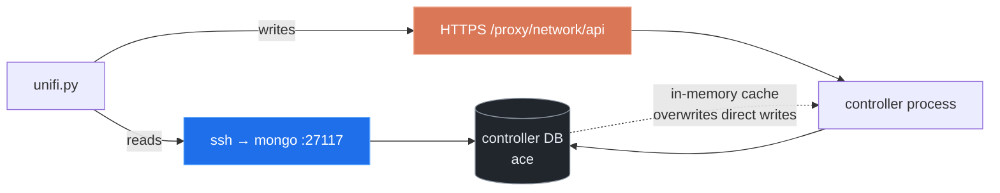

# unifi-cli

Changing the 5 GHz channel on five access points through the UniFi web UI takes
about sixty clicks. Every one of them is a single command here.

The bigger problem is that the UI won't show you most of what your controller
already knows. Radio policy, PMF mode, fast-roaming state, the RF policy that
quietly overrides the channel you just pinned — all of it is sitting in the
controller's Mongo database, and none of it has a page in the web app.

`unifi-cli` is a single-file Python CLI that reads the whole database and writes
through the official API.

## Two transports, deliberately

Reads and writes take different paths, for different reasons.



**Reads go to Mongo over SSH.** No credentials to configure, works the moment
you can SSH to the gateway, and it sees every collection — including settings
the web UI never renders.

**Writes go to the HTTPS API.** Never write to Mongo directly: the controller
caches config in memory and will happily overwrite you, or you desync the
config version and restore from backup.

## Install

No dependencies beyond the Python standard library.

```bash
git clone https://github.com/<you>/unifi-cli.git
cd unifi-cli
chmod +x unifi.py
./unifi.py whoami
```

Point it at your gateway with environment variables, or a `.env` file:

```bash
cp .env.example .env
```

```bash
UNIFI_HOST=192.168.1.1   # gateway address
UNIFI_SSH=udm            # ssh alias or host for reads
UNIFI_SITE=default       # controller site id
UNIFI_USER=              # local admin, for writes only
UNIFI_PASS=
```

Reads need only `UNIFI_SSH`. Writes need a **local** admin account — an SSO
admin cannot authenticate an API call, no matter how correct the password is.
Create one under Settings → Admins & Users → Add Admin, and tick *Restrict to
Local Access Only*.

## Usage

```bash
./unifi.py whoami         # connectivity, and whether writes are available
./unifi.py radios         # every radio: channel, width, tx power, clients
./unifi.py wlans          # SSIDs: security, WPA mode, PMF, fast roaming
./unifi.py networks       # networks / VLANs / DHCP / DNS
./unifi.py forwards       # port forwards
./unifi.py devices        # models and firmware
./unifi.py settings ips   # one settings key (omit the key for all of them)
./unifi.py collections    # everything else in the database
```

`whoami` tells you which half of the tool is live:

```text
host          192.168.1.1  (site: default)
ssh udm       ok — reads available
api creds     present — writes available
api login     ok as automation
```

`radios` is the one that replaces the sixty clicks:

```json
[
  {
    "ap": "Back Bedroom",
    "band": "2.4",
    "channel": 6,
    "clients": null,
    "min_rssi_enabled": false,
    "tx_power_mode": "medium",
    "width": 20
  },
  {
    "ap": "Back Bedroom",
    "band": "5",
    "channel": 116,
    "clients": null,
    "min_rssi_enabled": false,
    "tx_power_mode": "medium",
    "width": 80
  },
  {
    "ap": "Basement",
    "band": "5",
    "channel": 132,
    "clients": null,
    "min_rssi_enabled": false,
    "tx_power_mode": "auto",
    "width": "80"
  }
]
```

Anything the named views don't cover, read raw:

```bash
./unifi.py collections
./unifi.py read wlanconf --query '{name:"guest"}'
```

And write through the API:

```bash
./unifi.py api GET  /rest/wlanconf
./unifi.py api PUT  /rest/wlanconf/<id> '{"pmf_mode":"optional", ...}'
./unifi.py api POST /cmd/devmgr '{"mac":"...","cmd":"restart"}'
```

Paths that don't start with `/proxy/` or `/api/` get
`/proxy/network/api/s/<site>` prefixed automatically.

## Secrets are redacted by default

Every read is filtered through a recursive redactor that blanks anything whose
key matches passphrase, password, secret, PSK, private key, token, or shadow
hash. WPA passphrases do not end up in a terminal buffer, a log, or a paste.

```bash
./unifi.py read wlanconf          # "x_passphrase": "<redacted>"
./unifi.py read wlanconf --raw    # actually shows it
```

Use `--raw` only when the secret is the point.

Two details worth knowing. The curated views (`wlans`, `networks`, `forwards`)
never select secret fields in the first place, so redaction is a backstop there
rather than the primary defence — it earns its keep on `read` and `settings`,
which return whole documents. And only *truthy* values are blanked, so
`"passphrase_autogenerated": false` stays readable instead of becoming a
useless `<redacted>`.

## Things that have already bitten us

Hard-won, and the reason this repo exists at all:

- **UniFi PUTs replace the whole object.** `GET` the record, change the one
  field, `PUT` the entire document back. Sending only the changed key wipes
  everything else on that SSID or network.
- **AWDL is banned on DFS channels.** Apple peer-to-peer — Universal Control,
  AirDrop, Sidecar — breaks on any AP serving Macs if that AP sits on a DFS
  channel. Put the Mac-facing AP on 44 or 149: both are non-DFS *and* AWDL
  social channels, so the infrastructure link and the peer-to-peer link land
  on the same channel.
- **Meshed APs share a 5 GHz channel with their parent.** Changing either
  changes both. Keep that pair off DFS, or a radar hit takes the downstream AP
  offline.
- **DFS costs a channel-availability check** of one to ten minutes before the
  radio transmits at all. A blank 5 GHz column right after a change is normal,
  not a failure.
- **In GB regulatory domain, non-DFS 5 GHz is 36–48 and 149–165.** At 80 MHz
  that is two usable blocks, which is why a six-radio house ends up with most
  APs on DFS whether it wants to be or not.
- **`radio_ai` can override pinned channels.** If its RF policy still has
  `dfs: true`, don't set any AP back to Auto.

## uc-watch

`uc-watch.sh` is a companion for the hardest class of wifi bug: the intermittent
Apple peer-to-peer dropout. It streams logs from `rapportd`, `UniversalControl`,
`sharingd` and `bluetoothd`, and writes a state snapshot every 15 seconds —
channel, RSSI, PHY mode, AWDL status, and advertising and peer churn counts — so
a dropout can be correlated against what the radio was doing at that moment.

```bash
./uc-watch.sh          # writes to ~/uc-watch/
pkill -f uc-watch      # stop
```

It carries one warning worth repeating: **do not poll
`system_profiler SPAirPortDataType` in a monitoring loop.** It forces a
25-channel active scan lasting about twenty seconds, which takes the radio off
channel and starves AWDL and BLE — it *causes* the exact dropout the script
exists to observe. `ipconfig getsummary` reads cached state and costs nothing.

## Claude Code skill

The repo ships a [Claude Code](https://claude.com/claude-code) skill at
`.claude/skills/unifi/SKILL.md`. Clone the repo, open it in Claude Code, and
`/unifi` is available — or ask a plain question like *"why does AirDrop keep
dropping?"* and it triggers on its own.

It carries the command reference **and** the rules below, so the model knows to
`GET` before it `PUT`s, knows not to put a Mac-facing AP on a DFS channel, and
knows never to write to Mongo directly. That last part matters most: the
failure modes here are the kind an agent walks straight into.

Copy it to `~/.claude/skills/unifi/` to use it from anywhere.

## License

MIT. See [LICENSE](LICENSE).
